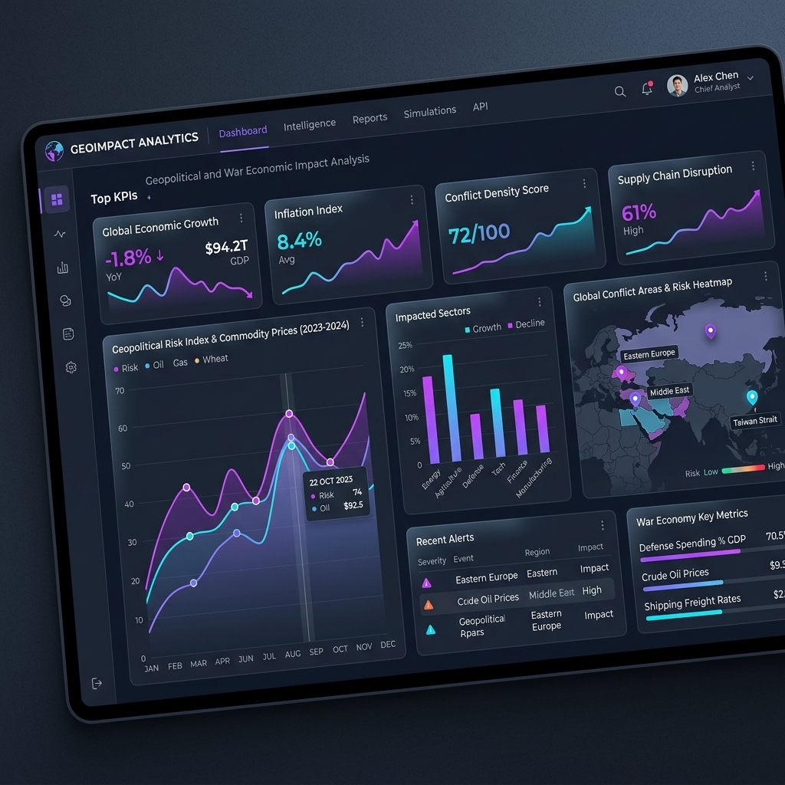

<div align="center">

# 🚀 Geopolitical & War Economic Impact Analysis Dashboard

### **A production-grade, full-stack analytical platform for real-time tracking, macroeconomic correlation, and geopolitical crisis management.**

[](https://react.dev/)
[](https://vite.dev/)
[](https://tailwindcss.com/)
[](https://redux-toolkit.js.org/)
[](https://nodejs.org/)
[](https://expressjs.com/)
[](https://www.mongodb.com/)
[](LICENSE)

---

🚀 **Live Frontend Demo**: [https://war-economic-impact-dataset-zeel-ku.vercel.app/](https://war-economic-impact-dataset-zeel-ku.vercel.app/)  
⚙️ **Production API Server**: [https://war-economic-impact-dataset-zeel.onrender.com/](https://war-economic-impact-dataset-zeel.onrender.com/)

---

[Explore Docs](#-api-overview) · [Report Bug](https://github.com/Zeelkundariya/war_economic_impact_dataset_zeel_kundariya/issues) · [Request Feature](https://github.com/Zeelkundariya/war_economic_impact_dataset_zeel_kundariya/issues)

</div>

<div align="center">



</div>

---

## 📌 Project Overview

**War Economic Impact Analysis** is a comprehensive full-stack ecosystem designed to analyze, visualize, and track the economic consequences of global conflicts. By processing a massive dataset, the system provides deep insights into how geopolitical crises correlate with major macroeconomic shifts: GDP contractions, hyperinflation spikes, poverty rates, reconstruction costs, and labor market shocks.

The project consists of a high-performance **Express/MongoDB REST API** and a stunning, responsive **React + Vite Dashboard client** utilizing glassmorphism aesthetics, dark mode synchronization, and interactive Recharts visualizations.

---

## 💡 Key Full-Stack Features

### 💻 Client Dashboard (React, Tailwind v4, MUI, Redux Toolkit, Recharts)
- **SaaS-Style Dashboard Overview:** Real-time KPI summaries of total conflicts, active crises, resolved events, and peak damage. Features an Area Chart of the top 10 most expensive conflicts, coupled with a Geopolitical Hazard side-panel.
- **Deep-Dive Analytics Matrix:** 4 high-fidelity interactive visual charts mapping regional conflict distribution, cost vs. reconstruction bar comparisons, GDP collapse vs. inflation scatter plots, and conflict type pie/donut compositions.
- **Database Table Grid:** Paginated conflict listings supporting keyword search, region filters, status filters, and 9 custom query sort options.
- **Formik + Yup Validated CRUD Modals:** Integrated modals for creating and editing database entries with complete input validations, alongside unrecoverable soft-delete warning modals.
- **User Settings & Diagnostics:** Light/Dark theme toggling, default row limit config, and real-time backend connection latency ping diagnostic checking.
- **Admin User Management:** Restricted table grid for system administrators to toggle admin privileges or permanently revoke analyst accounts.

### ⚙️ Backend REST API (Node.js, Express, Mongoose)
- **Custom In-Memory Rate Limiting:** High-fidelity rate limiters targeting endpoint abuses: `/auth/login`, `/auth/register`, `/conflicts`, `/search`, and `/admin`.
- **CORS Pre-Flight OPTIONS Handshake:** Fully custom OPTIONS responses for pre-flight safety mapping allowed HTTP methods on routes.
- **Metadata HEAD Requests:** Sub-second metadata endpoints returning headers like `X-Total-Count`, `Last-Modified`, `X-Session-Active`, and `X-API-Health`.
- **Advanced Sorting & Search Routing:** Standalone, optimized routes for versioned search queries (conflicts, economic metrics, sectors, black-market goods) and 9 specific query sorting parameters.
- **Security & Authorization:** Token-based JWT authentication with auth interceptors on client Axios instances.

---

## 📂 Project Structure

```text
war_economic_impact/
├── client/                     # React + Vite Frontend
│   ├── src/
│   │   ├── components/         # Layouts, Theme Wrappers, Modals, Navbars, Sidebars
│   │   ├── pages/              # Dashboard, Conflicts, Analytics, Profile, Settings, UserManagement
│   │   ├── services/           # Axios API configuration & JWT interceptors
│   │   ├── store/              # Redux slices (authSlice, dataSlice, uiSlice)
│   │   ├── App.jsx             # React Router routing tree & Route Guards
│   │   ├── index.css           # Tailwind base styles
│   │   └── main.jsx            # React root mount
│   └── README.md               # Frontend setup documentation
└── server/                     # Node.js + Express Backend
    ├── config/                 # MongoDB connection setup
    ├── controllers/            # API Route Controllers (auth, conflicts, admin, jwt)
    ├── middlewares/            # Auth guards & Custom rate limiters
    ├── models/                 # Mongoose schemas (User, Conflict)
    ├── routes/                 # Express route mounts
    ├── seeder.js               # Data importing script
    └── server.js               # Express server entry point
```

---

## ⚙️ API Overview

### 🔐 Authentication & Session
| Method | Endpoint | Description | Access | Rate Limit |
| :--- | :--- | :--- | :--- | :--- |
| POST | `/api/v1/auth/register` | User Registration | Public | 5 req / 15m |
| POST | `/api/v1/auth/login` | Secure JWT Login | Public | 5 req / 15m |
| GET | `/api/v1/auth/me` | Fetch Current Profile | Protected | Standard |
| PUT | `/api/v1/auth/profile` | Update Account Details | Protected | Standard |
| DELETE | `/api/v1/auth/account` | Delete Own Account | Protected | Standard |
| HEAD | `/api/v1/auth/me` | Retrieve Session Status | Protected | Standard |

### 📌 Conflict Database CRUD
| Method | Endpoint | Description | Access | Rate Limit |
| :--- | :--- | :--- | :--- | :--- |
| GET | `/api/v1/conflicts` | Fetch paginated conflicts | Public | 100 req / 15m |
| POST | `/api/v1/conflicts` | Create a new conflict entry | Protected | 100 req / 15m |
| PUT | `/api/v1/conflicts/:id` | Update full conflict entry | Protected | 100 req / 15m |
| DELETE | `/api/v1/conflicts/:id` | Remove record (Soft delete) | Protected | 100 req / 15m |
| HEAD | `/api/v1/conflicts` | Get total count header | Public | Standard |
| HEAD | `/api/v1/conflicts/:id` | Get last modified header | Public | Standard |

### 🔍 Search & Specialized Sort
| Method | Endpoint | Description | Access | Rate Limit |
| :--- | :--- | :--- | :--- | :--- |
| GET | `/api/v1/search/conflicts` | Search by country, region, type, status | Public | 30 req / 15m |
| GET | `/api/v1/search/economic` | Search by inflation, poverty, GDP bounds | Public | 30 req / 15m |
| GET | `/api/v1/search/sector` | Search by affected economic sector | Public | 30 req / 15m |
| GET | `/api/v1/search/black-market`| Search by traded black-market goods | Public | 30 req / 15m |
| GET | `/api/v1/conflicts?sort=GDP_Change_%` | Sort by GDP change, inflation, costs | Public | 100 req / 15m |

### 📊 Aggregates & Diagnostics
| Method | Endpoint | Description | Access | Rate Limit |
| :--- | :--- | :--- | :--- | :--- |
| GET | `/api/v1/stats/total-conflicts`| Get total count statistic | Public | Standard |
| GET | `/api/v1/stats/highest-war-cost`| Get peak war cost record | Public | Standard |
| GET | `/api/v1/health` | API & MongoDB Health Check | Public | Standard |
| HEAD | `/api/v1/health` | Diagnostics head request | Public | Standard |

### 👑 Admin User Management
| Method | Endpoint | Description | Access | Rate Limit |
| :--- | :--- | :--- | :--- | :--- |
| GET | `/api/v1/admin/users` | List all user accounts | Admin | Standard |
| PUT | `/api/v1/admin/users/:id/role`| Toggle admin privilege status | Admin | Standard |
| DELETE | `/api/v1/admin/users/:id` | Permanent user account deletion | Admin | Standard |
| GET | `/api/v1/admin/dashboard` | Aggregated monetary totals stats | Admin | 10 req / 15m |

---

## 🚀 Getting Started

### 1️⃣ Clone Repository
```bash
git clone https://github.com/Zeelkundariya/war_economic_impact_dataset_zeel_kundariya.git
cd war_economic_impact_dataset_zeel_kundariya
```

### 2️⃣ Initialize Database
Ensure local MongoDB server is installed.
1. Create a local database folder to avoid system pollution:
   ```bash
   mkdir db
   ```
2. Start MongoDB:
   ```bash
   mongod --dbpath ./db
   ```

### 3️⃣ Backend Setup & Seed Data
1. Navigate to the server folder and install dependencies:
   ```bash
   cd server
   npm install
   ```
2. Configure environmental variables inside a `.env` file in the `server/` directory:
   ```env
   PORT=5000
   MONGO_URI=mongodb://localhost:27017/war_economic_impact
   JWT_SECRET=mysecretkey123
   NODE_ENV=development
   ```
3. Import seed data (populated with mock database records):
   ```bash
   npm run data:import
   ```
4. Start the backend:
   ```bash
   npm run dev
   ```

### 4️⃣ Frontend Dashboard Setup
1. Navigate to the client folder and install dependencies:
   ```bash
   cd ../client
   npm install
   ```
2. Start the development server (proxies `/api` routes automatically to port `5000`):
   ```bash
   npm run dev
   ```
3. Open your browser and navigate to **[http://localhost:5173/](http://localhost:5173/)**.

---

<div align="center">

### Built with ❤️ by [Zeel Kundariya](https://github.com/Zeelkundariya)

**[↑ Back to Top](#-geopolitical--war-economic-impact-analysis-dashboard)**

</div>
